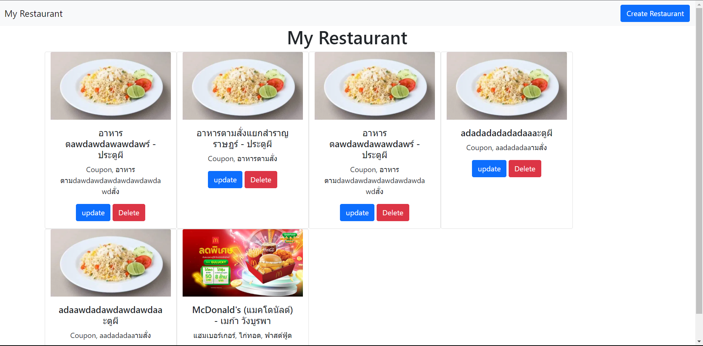

# Restaurant Resful API Frontend
## Authur : Bowornlak

Page index 
```bash
index.html will be main page and index.js is keep function GetAll and delete function
```


Page add
 ```bash
add.html will show build information to create new restaurant and add.js is function
```


Page update
```bash
update.html will show information to edit restaurant 
```


